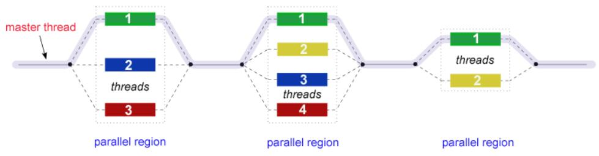

# 1. 简介

OpenMP 采用多线程共享内存的方式进行并行计算。

其与 Pthread 也存在一些本质的区别，如下图所示:


## 1.1 Fork-Join 模型



所有 OpenMP 程序都开始于一个主线程。主线程按顺序执行，直到遇到第一个`并行区域结构`。

- `FORK`：主线程然后创建一组并行的子线程。之后程序中由并行区域结构封装的语句在各个子线程中并行执行。

- `JOIN`：当子线程完成并行区域结构中的语句时，它们将进行**同步**并**终止**，只留下主线程。

并行区域结构的数量和运行它们的线程是任意的。

并行区域结构如下图所示:


## 1.2 语法

> OpenMP 采用 `#pragma omp ... {}` 的语法来限定并行区域结构。

## 1.3 编译

> 为了使用 gcc 编译 omp 程序，需要添加 `-fopenmp` 编译选项。

# 编译器指令

## parallel num_threads(xxx) 和 parallel 指令

其中，`xxx` 由用户进行指定，代表并行子线程的数量。

```cpp
#include <iostream>
#include <omp.h>

void hello() {
    int id = omp_get_thread_num();
    int sum = omp_get_num_threads();
    std::cout << "Hello World from thread " << id << " of " << sum << std::endl;
}

int main() {

    // 手动指定并行子线程数量
#pragma omp parallel num_threads(6)
    { hello(); }
    // 默认是 cpu core 的数量的并行子线程
#pragma omp parallel
    { hello(); }
    return 0;
}
```

## parallel for num_threads(xxx) 和 parallel for 指令

其中，`xxx` 由用户进行指定，代表并行子线程的数量。

`parallel for 指令`会告诉编译器，接下来的 `for 循环`将会使用并行的方式执行。

`for 循环`需要满足四个要求，如下图所示：


示例代码如下所示:

```cpp
#include <chrono>
#include <iostream>
#include <omp.h>
#include <vector>

int main() {

    std::vector<uint64_t> vec(1000000, 1);
    auto now = std::chrono::high_resolution_clock::now();
    for (int i = 0; i < vec.size(); i++) {
        vec[i] = i;
    }
    auto end = std::chrono::high_resolution_clock::now();
    auto duration =
        std::chrono::duration_cast<std::chrono::nanoseconds>(end - now);
    std::cout << "Normal Time taken: " << duration.count() << " ns"
              << std::endl;

    now = std::chrono::high_resolution_clock::now();
#pragma omp parallel for
    // 1. i 就是迭代器, 是可计算的，也确定了迭代的次数就是 vec 的长度
    // 2. i 只被增量表达式 ++ 了
    // 3. 无任何跳转语句
    // 因此满足需求。
    for (int i = 0; i < vec.size(); i++) {
        vec[i] = i;
    }

    end = std::chrono::high_resolution_clock::now();
    duration = std::chrono::duration_cast<std::chrono::nanoseconds>(end - now);
    std::cout << "OpenMP time taken: " << duration.count() << " ns"
              << std::endl;

    return 0;
}
```

> 如果数据之间存在依赖关系，使用 `parallel for 指令` 并不能被正确的并行化，也就无法确保输出正确的结果。示例代码如下:

```cpp
#include <iostream>
#include <omp.h>
#include <vector>

int main(int argc, char *argv[]) {

    std::vector<uint64_t> vec(20, 1);
    auto thread_count = std::stoi(argv[1]);

#pragma omp parallel for num_threads(thread_count)
    for (int i = 2; i < vec.size(); i++) {
        vec[i] = vec[i - 1] + vec[i - 2];
    }

    for (int i = 0; i < vec.size(); i++) {
        std::cout << vec[i] << " ";
    }
    // 1 1 2 3 5 8 13 21 34 55 89 144 233 377 2 3 5 8 13 21
    // 输出结果是错误的
    return 0;
}
```

## private 指令

如果希望将原本共享的变量，在并行区域结构中变成私有的(即在每个运行的子线程中都有单独的副本), 则可以使用 private 指令。

特点：

- 所有的子线程都不会使用到先前的定义。
- 所有的子线程都不能给原本共享的变量赋值。

示例代码如下所示：

```cpp
#include <iostream>
#include <omp.h>
#include <vector>

int main(int argc, char *argv[]) {

    std::vector<uint64_t> a(10000, 1);
    std::vector<uint64_t> b(10000, 0);
    for (int i = 0; i < a.size(); i++) {
        a[i] = i;
    }
    uint64_t tmp = 3;
    auto thread_count = std::stoi(argv[1]);

// #pragma omp parallel for num_threads(thread_count)
// 假设现在 thread_count 是 4, 那么这个循环会被分成 4 个部分,
// 每个部分会被一个线程执行, 而 tmp 是一个共享变量,
// 那么就存在多个线程同时修改 tmp 的情况, 导致结果出错。此时就需要将 tmp
// 变成私有变量。
#pragma omp parallel for num_threads(thread_count) private(tmp)
    for (int i = 0; i < a.size(); i++) {
        tmp = a[i];
        b[i] = tmp * tmp;
    }

    for (int i = 0; i < a.size(); i++) {
        if (b[i] != a[i] * a[i]) {
            std::cout << "Error at index " << i << std::endl;
            return 1;
        }
    }
    // 原来 tmp 是什么值就是什么值
    std::cout << "Success, tmp is " << tmp << std::endl;
    return 0;
}
```

## firstprivate 指令

firstprivate 指令告诉编译器私有变量在每个子线程的第一个循环会继承共享变量的值

```cpp
#include <iostream>
#include <omp.h>

int main(int argc, char *argv[]) {

    uint64_t tmp = 3;
    auto thread_count = std::stoi(argv[1]);

#pragma omp parallel for num_threads(thread_count) firstprivate(tmp)
    for (int i = 0; i < 8; i++) {
        ++tmp;
        auto tid = omp_get_thread_num();
        auto nthreads = omp_get_num_threads();
        std::cout << "Thread " << tid << " of " << nthreads << " tmp is " << tmp
                  << std::endl;
    }

    // 原来 tmp 是什么值就是什么值
    std::cout << "Success, tmp is " << tmp << std::endl;
    return 0;
}
```

## lastprivate 指令

lastprivate 指令会在最后一个迭代器出循环的时候更改原有共享变量的值。

```cpp
#include <iostream>
#include <omp.h>

int main(int argc, char *argv[]) {

    uint64_t tmp = 3;
    auto thread_count = std::stoi(argv[1]);

#pragma omp parallel for num_threads(thread_count) lastprivate(tmp)
    for (int i = 0; i < 8; i++) {
        auto tid = omp_get_thread_num();
        // 会在 i == 7 的时候将共享变量 tmp 更新
        // 可以更新为任意同类型值
        tmp = i;
        auto nthreads = omp_get_num_threads();
        std::cout << "Thread " << tid << " of " << nthreads << " tmp is " << tmp
                  << std::endl;
    }

    std::cout << "Success, tmp is " << tmp << std::endl;
    return 0;
}
```

## 切片指令

切片指令相关的一系列指令是在`并行块`里面使用的。

### single 指令

- single 指令紧跟的代码块将会只由一个子线程执行
- single 指令在处理多段线程不安全代码时非常有用
- 在不使用 `no wait` 选项时，在多个子线程中不执行 single 代码块的所有线程都会等待 single 代码块执行结束。

```cpp
#include <chrono>
#include <iostream>
#include <omp.h>
#include <thread>

int main(int argc, char *argv[]) {

    auto thread_count = std::stoi(argv[1]);

#pragma omp parallel num_threads(thread_count)
    {
        std::cout << "Hello, World!" << std::endl;
// #pragma omp single // 会阻塞等待
#pragma omp single nowait // 不会阻塞等待
        {
            auto tid = omp_get_thread_num();
            std::this_thread::sleep_for(std::chrono::seconds(1));
            auto nthreads = omp_get_num_threads();
            std::cout << "Thread " << tid << " of " << nthreads << std::endl;
        }
        std::cout << "end" << std::endl;
    }

    return 0;
}
```

### master 指令

- master 指令紧跟的代码块只会由 tid 为 0 的子线程执行
- 不会出现等待的情况

```cpp
#include <chrono>
#include <iostream>
#include <omp.h>
#include <thread>

int main(int argc, char *argv[]) {

    auto thread_count = std::stoi(argv[1]);

#pragma omp parallel num_threads(thread_count)
    {
        std::cout << "Hello, World!" << std::endl;
#pragma omp master
        {
            // 这里的 tid 一定为 0
            auto tid = omp_get_thread_num();
            std::this_thread::sleep_for(std::chrono::seconds(1));
            auto nthreads = omp_get_num_threads();
            std::cout << "Thread " << tid << " of " << nthreads << std::endl;
        }
        std::cout << "end" << std::endl;
        // 如果 thread_count > 1, 除了 tid 为 0 的线程会等待
        // 1s，请他的线程都执行到了这里
    }

    return 0;
}
```

### section 和 sections 指令

- sections
- 每个独立的 section 代码块都需要在 sections 代码块里面
  - 每个 section 都是被一个线程所执行
  - 不同的section 可能执行不同的任务
  - 如果一个线程够快，该线程可能执行多个 section

```cpp
#include <chrono>
#include <iostream>
#include <omp.h>
#include <thread>

int main(int argc, char *argv[]) {

    auto thread_count = std::stoi(argv[1]);

#pragma omp parallel num_threads(thread_count)
    {
        std::cout << "Hello, World!" << std::endl;
#pragma omp sections
        {
            // 可能线程A执行这个 section
#pragma omp section
            {
                auto tid = omp_get_thread_num();
                std::this_thread::sleep_for(std::chrono::seconds(1));
                auto nthreads = omp_get_num_threads();
                std::cout << "Thread " << tid << " of " << nthreads
                          << std::endl;
            }
            // 可能线程B执行这个 section
#pragma omp section
            {
                auto tid = omp_get_thread_num();
                std::this_thread::sleep_for(std::chrono::seconds(1));
                auto nthreads = omp_get_num_threads();
                std::cout << "Thread " << tid << " of " << nthreads
                          << std::endl;
            }
        }
        std::cout << "end" << std::endl;
    }

    return 0;
}
```

## reduction 指令

- 它会提供一个私有变量的拷贝并且初始化该私有变量, 初始化的值取决于归并的操作符，如下图所示：
  

- 在最后的出口中，所有变量拷贝将会通过操作符所定义的规则进行合并计算(包括原有的共享变量的值)，然后更新相应的共享变量

```cpp
#include <chrono>
#include <iostream>
#include <omp.h>
#include <thread>

int main(int argc, char *argv[]) {

    auto thread_count = std::stoi(argv[1]);

    int j = 10;

#pragma omp parallel num_threads(thread_count) reduction(+ : j)
    {
        std::cout << "Hello, World!" << std::endl;
#pragma omp sections
        {
            // 可能线程A执行这个 section
#pragma omp section
            {
                auto tid = omp_get_thread_num();
                std::this_thread::sleep_for(std::chrono::seconds(1));
                auto nthreads = omp_get_num_threads();
                // j 初始化为0，所以这里 j = 10
                j += 10;
                std::cout << "Thread " << tid << " of " << nthreads
                          << std::endl;
            }
            // 可能线程B执行这个 section
#pragma omp section
            {
                auto tid = omp_get_thread_num();
                std::this_thread::sleep_for(std::chrono::seconds(1));
                auto nthreads = omp_get_num_threads();
                // j 初始化为0，所以这里 j = 20
                j += 20;
                std::cout << "Thread " << tid << " of " << nthreads
                          << std::endl;
            }
        }
        std::cout << "end" << std::endl;
    }

    // 最后合并的时候, 第一个 section 的结果是 10，第二个 section 的结果是 20,
    // 最初的 j 是 10, 所以最后的结果是 40
    std::cout << "j = " << j << std::endl;

    return 0;
}
```

## barrir 指令

用于同步并行块中的所有子线程在某一段代码前同步等待

- parallel for 和 single 在代码块最后默认添加了 barrir 指令
- 可以使用 nowait 指令消除 barrir 指令的同步行为

示例代码如下所示：

```cpp
#include <iostream>
#include <omp.h>

int main(int argc, char *argv[]) {

    auto thread_count = std::stoi(argv[1]);

#pragma omp parallel num_threads(thread_count)
    {
        std::cout << "Hello, World!" << std::endl;
        auto tid = omp_get_thread_num();
        auto nthreads = omp_get_num_threads();

        // 添加了这个 barrier 之后，所有线程都会等待，直到所有线程都到达这个
        // barrier
#pragma omp barrier
        if (tid == 0) {
            std::cout << "Number of threads = " << nthreads << std::endl;
        }
    }

    return 0;
}
```

## critical 指令

使的接下来的一段代码块在同一时间段将会只由一个线程执行，相当于就是创建了一块临界区。

- 好处：解决了数据竞争的现象。
- 坏处：会减少程序并行化程度。

示例代码如下：

```cpp
#include <iostream>
#include <omp.h>

int main(int argc, char *argv[]) {

    auto thread_count = std::stoi(argv[1]);
    int j = 0;

#pragma omp parallel for num_threads(thread_count)
    for (int i = 0; i < 10000; ++i) {
        auto tid = omp_get_thread_num();
        auto nthreads = omp_get_num_threads();

        // 同一时刻只有一个线程在执行 j++ 操作
#pragma omp critical
        { j++; }
    }
    std::cout << j << std::endl;

    return 0;
}
```

## atomic 指令

使得接下来的一条语句是原子操作的。

- 只在特殊的情况下使用：
  - 在自增或自减的情况下使用。
  - 在二元操作数的情况下使用。

示例如下所示：

```cpp
#include <iostream>
#include <omp.h>

int main(int argc, char *argv[]) {

    auto thread_count = std::stoi(argv[1]);
    int j = 0;

#pragma omp parallel for num_threads(thread_count)
    for (int i = 0; i < 10000; ++i) {
        auto tid = omp_get_thread_num();
        auto nthreads = omp_get_num_threads();

        // 同一时刻只有一个线程在执行 j++ 操作
        // 使用 {} 包裹 j++ 是语法错误
        #pragma omp atomic
        j++;
    }
    std::cout << j << std::endl;

    return 0;
}
```

与 critical 指令的区别, 如下图所示：


## scheduler 指令
