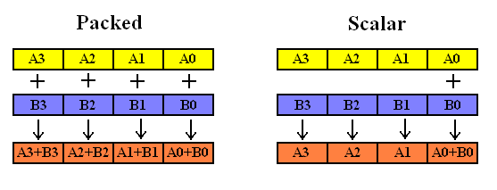
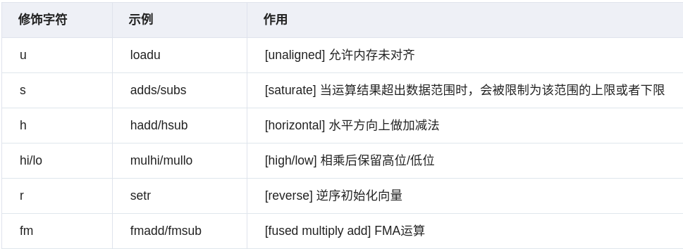
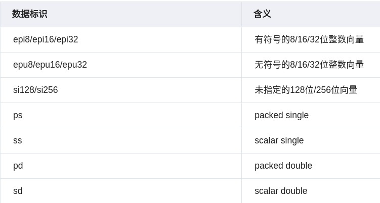

# 简介

1. SIMD(Single Instruction, Multiple Data) 是一种 CPU 层面的并行计算技术。其使用`向量寄存器`存储多个数据，并使用单条指令同时对这些数据进行处理，从而提高计算效率。
2. 许多现代 CPU 都支持 SIMD 指令集扩展，X86 平台有 SSE/AVX 指令集，ARM 平台有 NEON 指令集。

# 指令集

| 指令集  | 寄存器       | 浮点位宽 | 整型位宽 | 补充说明                                            |
| ------- | ------------ | -------- | -------- | --------------------------------------------------- |
| MMX     | MM0 - MM7    | 不支持   | 64       | 第一代                                              |
| SSE     | XMM0 - XMM7  | 128      | 不支持   | 兼容 MMX                                            |
| SSE2    | XMM0 - XMM15 | 128      | 128      | 兼容 SSE                                            |
| AVX     | YMM0 - YMM15 | 256      | 128      | 兼容 SSE2                                           |
| AVX2    | YMM0 - YMM15 | 256      | 256      | 兼容 AVX,也支持了FMA(Fused Multiply Accumulate)指令 |
| AVX-512 | YMM0 - YMM15 | 512      | 512      | 兼容 AVX2                                           |

# SIMD 编程基础

## c++头文件

```cpp
#include <mmintrin.h>   // MMX
#include <xmmintrin.h>  // SSE(include mmintrin.h)
#include <emmintrin.h>  // SSE2(include xmmintrin.h)
#include <pmmintrin.h>  // SSE3(include emmintrin.h)
#include <tmmintrin.h>  // SSSE3(include pmmintrin.h)
#include <smmintrin.h>  // SSE4.1(include tmmintrin.h)
#include <nmmintrin.h>  // SSE4.2(include smmintrin.h)
#include <ammintrin.h>  // SSE4A (AMD 平台独有的指令集)
#include <wmmintrin.h>  // AES(include nmmintrin.h)
#include <immintrin.h>  // AVX, AVX2, FMA(include wmmintrin.h)
```

- 若要包含全部头文件，GCC/Clang 环境下直接包含 `<x86intrin.h>` 即可，MSVC 环境下直接包含 `<intrin.h> `即可。

## 内存对齐

- 有很多 SIMD 指令要求内存对齐，比如 SSE 指令 `_mm_load_ps` 函数，要求输入地址是 16 字节对齐的，否则可能导致程序崩溃或得不到正确结果。
- 如果无法保证输入地址是 16 字节对齐的，就必须使用不要求内存对齐的 `_mm_loadu_ps` 函数。
- 内存不对齐的版本通常运行更慢。

> 在栈上定义时的内存对齐

```cpp
    alignas(16) float a[4] = {1.0, 2.0, 3.0, 4.0};
    alignas(16) float b[4] = {5.0, 6.0, 7.0, 8.0};
    alignas(16) float c[4];
```

> 在堆上定义时的内存对齐

```cpp
// MSVC
auto a = (float*)_aligned_malloc(4 * sizeof(float), 16);
_aligned_free(a);
// GCC
auto a = (float*)aligned_alloc(16,4 * sizeof(float));
free(a);
```

## 数据类型

SIMD 指令使用自定义数据类型，比如 `__m64`，`__m128d`, `__m256i`等，命名由三部分组成:

- 前缀: 统一为 `__m`
- 位宽: 比如 64, 128, 256, 512
- 类型: `i` 表示整型，`d` 表示 double，什么都不加表示 float

## 运算模式

`浮点数` 运算模式可以分为两类: `packed` 和 `scalar`。packer 模式一次对向量寄存器中的所有浮点数进行计算，scalar 模式一次对向量寄存器中最低位的一个浮点数进行计算。如下图所示。


## 函数命名

SIMD 指令的 intrin 函数命名风格如下:

```sh
_mm<bit_width>_<name>[options]_<data_type>
```

bit_width: 表示数据向量的位宽。比如: `_mm` 表示 64/128 位，`_mm256` 表示 256 位。
name: 表示函数的功能。比如 load、mul、add 等。
options: 表示可选的修饰词，用来实现某种特殊的作用。如下图所示:

data_type: 表示数据类型。如下图所示:


## 编译问题

```sh
# 在编译AVX-512 时, 需要启用 AVX512 的支持。
g++ -mavx512f -o your_program your_program.cpp
# 检查 cpu 是否支持 AVX-512 指令。
grep -m 1 avx512 /proc/cpuinfo
```
